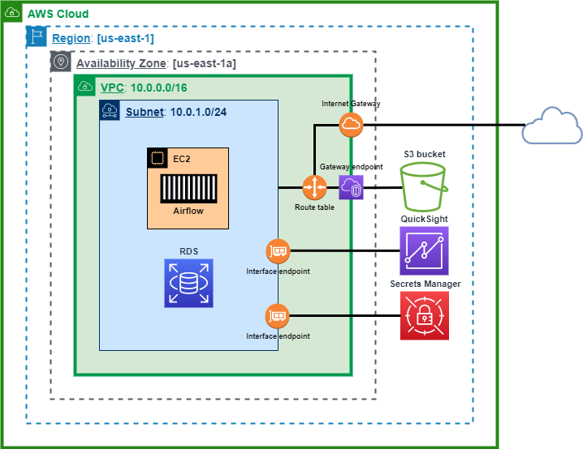
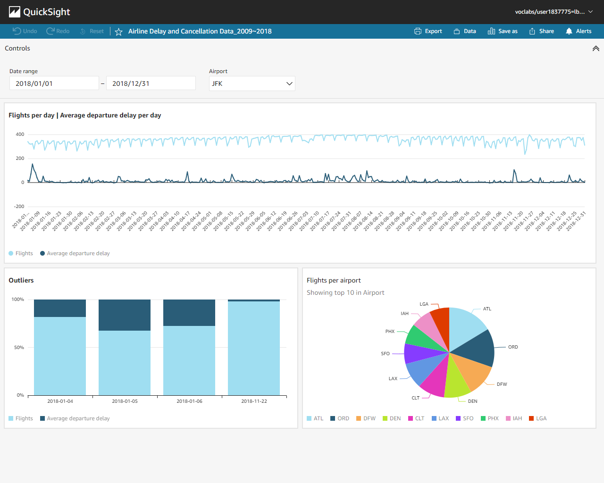
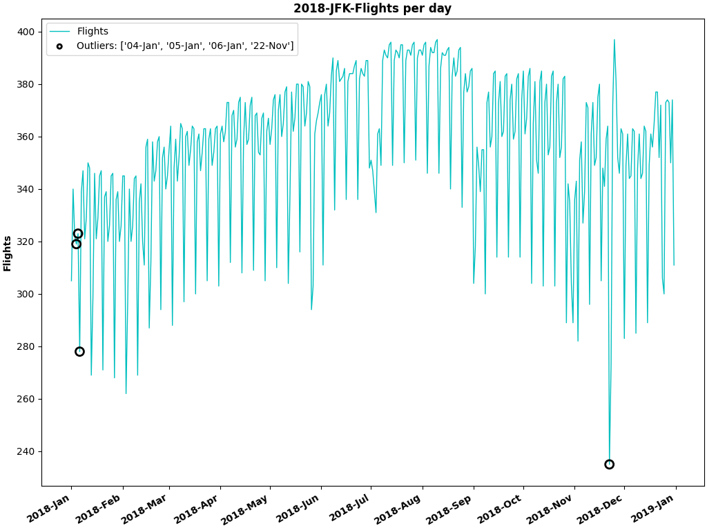

## Cloud ML Engineering ##
### 1. Definición del problema: ###
* Cargar el dataset de Kaggle: Airline Delay and Cancellation Data_2009~2018 en un bucket de Amazon S3.
* Configurar Apache Airflow para que corra en un instancia de Amazon EC2.
* Crear una instancia de Amazon RDS (Engine type: PostgreSQL) que será utilizada como BD en los siguientes puntos.
* Desarrollar un DAG de Airflow con schedule anual:
  * El DAG debe funcionar para cualquiera de los años incluidos en el dataset (2009~2018).
  * Tener en cuenta que si se corre dos veces para el mismo año no produzca duplicación de datos.
  * Calcular el promedio del tiempo de demora de salida (Columna: DEP_DELAY) por aeropuerto de salida (Columna: ORIGIN) y dia.
  * Calcular por cada aeropuerto la cantidad de vuelos por día.
  * Utilizar un algoritmo de detección de anomalías (scikit-learn) para identificar por cada aeropuerto si hubo algún día con demoras y cantidad de vuelos fuera de lo normal.
  * Generar un gráfico (Matplotlib) por cada aeropuerto con la cantidad de vuelos por día con alguna indicación en los días que fueron considerados anómalos.
  * Los gráficos generados deben ser almacenados en un path de Amazon S3 fácilmente identificable por año y aeropuerto analizado.
  * Cargar la data sumarizada indicando por fila si para ese día en un aeropuerto particular las demoras estuvieron fuera de lo esperable.
* Configurar un dashboard en Amazon QuickSight para poder visualizar los datos cargados.
- - - -
### 2. Diagrama de arquitectura: ###

- - - -
### 3. Descripción de las partes que incluye la arquitectura desarrollada: ###
**Amazon S3**:
* Un bucket de S3 para almacenar el dataset y los gráficos generados por el DAG de Airflow.

**Amazon EC2**:
* Una instancia de EC2 para configurar Airflow.

**Amazon RDS**:
* Una instancia de RDS para cargar el dataset y la data sumarizada generada por el DAG de Airflow.

**AWS Secret Manager**:
* Un secreto de Secrets Manager para guardar las credenciales de la BD de RDS.

**Amazon QuickSight**:
* Un dashboard de QuickSight con la data sumarizada.

**DAG de Airflow**:
* **Dag Run**:
  * ~4Min por año
* **Tasks**:
  * **t1_create_database:**
    * En caso de no existir, crea la base de datos:
      *  **FL_DELAY**
  * **t2_create_table**:
    * En caso de no existir, crea las tablas:
      * **CSV_%YYYY**
      * **DASHBOARD**
  * **t3_copy_from**:
    * En caso de no existir, carga los renglones del archivo: %YYYY.csv en la tabla: CSV_%YYYY:
      * **s3://mybucket/.CSV/%YYYY.csv** en la tabla: **CSV_%YYYY**
  * **t4_outlier_detection**:
    * Identifica por cada aeropuerto si hubo algún día con demoras y cantidad de vuelos fuera de lo normal.
    * En caso de no existir, carga la data sumarizada en la tabla: **DASHBOARD** indicando por fila si la observación pertenece a la misma distribución que las observaciones existentes (inlier; INLIER=1), o debe considerarse como diferente (outlier; INLIER=0).
    * **Local Outlier Factor (LOF)**:
      * _El algoritmo de detección de anomalías mide la desviación local de la densidad de una muestra dada con respecto a sus vecinos. Es local en el sentido de que la puntuación de anomalía depende de qué tan aislada esté la muestra con respecto al vecindario circundante._
      * **Vector que representa una muestra**: (Cantidad de vuelos por día; Promedio del tiempo de demora de salida por día).
      * **Número de features**: 2.
      * **Muestras**: Matriz NumPy ordenada por fecha «número de muestras de un aeropuerto por número de features».
      * **Número de vecinos**: 10% del número de muestras de un aeropuerto.
      * **Proporcición de outliers en el conjunto de muestras**: 1% (Umbral).
  * **t5_matplotlib**:
    * En caso de no existir, genera un gráfico por cada aeropuerto con la cantidad de vuelos por día destancando los que fueron considerados anómalos.
    * Los gráficos se almacenan en el siguiente path:
      * **s3://mybucket/.PNG/%YYYY/%IATA_airport_code.png**

- - - -
### 4. Instrucciones para crear y configurar los recursos necesarios para reproducir el desarrollo y dejarlo operativo: ###
**VPCs**:
* Crear la VPC_10.0.0.0/16 en la región: us-east-1.
  * Edit
    * DNS hostnames:
      * Enable
    * DNS resolution:
      * Enable

**Subnets**:
* Crear 2 subnets en la VPC_10.0.0.0/16 con la salvedad de hacerlo en diferentes AZs de la Región: us-east-1, porque es requerido al momento de lanzar una instancia de RDS.
  * Subnets:
    * Subnet_01: 10.0.1.0/24 | AZ: us-east-1a
    * Subnet_02: 10.0.2.0/24 | AZ: us-east-1b

**Internet gateways**:
* Crear 1 internet gateway y asociarlo a la VPC_10.0.0.0/16.

**Route Tables**:
* Asociar las 2 subnets con la route table de la VPC_10.0.0.0/16 y agregar la siguiente ruta: Destination: 0.0.0.0/0 | Target: Internet Gateway.

**Security Groups**:
* Crear 4 security groups en la VPC_10.0.0.0/16:
  * SG_EC2:
    * Inbound rules:
      * Type: SSH | Source: My IP
    * Outbound rules:
      * Type: All traffic | Destination: Anywhere-IPv4
  * SG_Secrets_Manager:
    * Inbound rules:
      * Type: HTTPS | Source: ID_SG_EC2
    * Outbound rules:
      * Type: All traffic | Destination: Anywhere-IPv4
  * SG_RDS:
    * Inbound rules:
      * Type: PostgreSQL | Source: ID_SG_EC2
      * Type: PostgreSQL | Source: ID_SG_QuickSight
    * Outbound rules:
      * Type: All traffic | Destination: Anywhere-IPv4
  * SG_QuickSight:
    * Inbound rules:
      * Type: All TCP | Source: ID_SG_RDS
    * Outbound rules:
      * Type: PostgreSQL | Destination: ID_SG_RDS

**VPC Endpoints**:
* Crear 2 VPC Endpoints en la VPC_10.0.0.0/16:
  * VPCE_S3:
    * Services:
      * Service Name: com.amazonaws.us-east-1.s3 | Type: Gateway
    * Route tables:
      * Route Table ID: ID_RTB_VPC
  * VPCE_Secrets Manager:
    * Services:
      * Service Name: com.amazonaws.us-east-1.secretsmanager | Type: Interface
    * Subnets:
      * Availability Zone: us-east-1a
      * Subnet ID: Subnet_01
    * Security groups:
      * Security group name: SG_Secrets_Manager

**Amazon S3**:
* Crear el bucket_name='mybucket' en la región: us-east-1.

**Amazon RDS**:
* Crear 1 db subnet group en la VPC_10.0.0.0/16:
  * Name: db subnet group
    * VPC: 10.0.0.0/16
  * Availability Zones:
    * us-east-1a
    * us-east-1b
  * Subnets:
    * Subnet_01: 10.0.1.0/24
    * Subnet_02: 10.0.2.0/24
* Crear 1 instancia de RDS en la VPC_10.0.0.0/16:
  * Engine options:
    * Engine type: PostgreSQL
    * Version: PostgreSQL 12.9-R1
  * Settings:
    * DB instance identifier: mydbinstance
    * Master username: airflow
    * Master password: ML2022
  * DB instance class:
    * Bustable classes (includes t classes):
      * db.t2.micro
    * Storage:
      * Storage type: General Purpose SSD (gp2)
      * Allocated storage: 20 GiB 
  * Connectivity:
    * Virtual private cloud (VPC): 10.0.0.0/16
    * Subnet group: db subnet group
    * Public access: No
    * Choose existing VPC security groups: ID_SG_RDS
    * Availability Zone: us-east-1a

**AWS Secret Manager**:
* Crear el secret_name='RDS/Postgres' para guardar las credenciales de la BD de RDS.
  * Secret type:
    * Credentials for Amazon RDS database
  * Credentials:
    * User name: airflow
    * Password: ML2022
  * Database:
    * DB instance: mydbinstance
  * Secret name and description
    * Secret name: RDS/Postgres

**Amazon EC2**:
* Lanzar 1 instancia de EC2 en la VPC_10.0.0.0/16:
  * Choose an Amazon Machine Image:
    * AMI: Amazon Linux 2 - Kernel 5.10
  * Choose an Instance Type:
    * Family: t2
    * Type: t2.large
  * Configure Instance Details:
    * Network: VPC_10.0.0.0/16
    * Subnet: Subnet_01_10.0.1.0/24
    * Auto-assign Public IP: Enable
    * IAM role: LabInstanceProfile
  * Add Storage:
    * Size: 30 GiB
    * Volume Type: General Purpose SSD (gp2)
  * Add Tags:
    * Name: Airflow
  * Configure Security Group:
    * Select an existing security group: ID_SG_EC2
* Ejecutar los siguientes comandos para instalar Git, Docker, Docker Compose y Kaggle en la instancia de EC2:
  * `sudo yum update -y`
  * `sudo yum install git -y`
  * `sudo amazon-linux-extras install docker -y`
  * `sudo service docker start`
  * `sudo systemctl enable docker`
  * `sudo usermod -a -G docker ec2-user`
  * `sudo curl -L "https://github.com/docker/compose/releases/download/1.29.2/docker-compose-$(uname -s)-$(uname -m)" -o /usr/local/bin/docker-compose`
  * `sudo chmod +x /usr/local/bin/docker-compose`
  * `pip3 install kaggle`
  * `exit`
* Ejecutar el siguiente comando para descargar el repositorio de GitHub:
  * `git clone https://github.com/lbodnarin/Cloud_ML_Engineering.git`
* Luego, ejecutar los siguientes comandos para descargar y sincronizar el dataset de Kaggle con el bucket de S3:
  * `mv ~/Cloud_ML_Engineering/.kaggle/ ~`
  * `chmod 600 ~/.kaggle/kaggle.json`
  * `kaggle datasets download -d yuanyuwendymu/airline-delay-and-cancellation-data-2009-2018`
  * `unzip airline-delay-and-cancellation-data-2009-2018.zip -d ~/.CSV/`
  * `aws s3 sync ~/.CSV/ s3://mybucket/.CSV/`
  * `rm -rf ~/.CSV/ ~/airline-delay-and-cancellation-data-2009-2018.zip`
* Por último, ejecutar los siguientes comandos para iniciar el DAG de Airflow:
  * `cd Cloud_ML_Engineering`
  * `docker-compose up airflow-init`
  * `docker-compose up -d`

**Amazon QuickSight**:
* Manage QuickSight:
  * Manage VPC connections:
    * Agregar 1 VPC connection en la VPC_10.0.0.0/16 y asociarla con el ID_SG_QuickSight.
* Luego, crear un dataset a partir de un RDS data source:
  * Instance ID: mydbinstance
  * Connection type: VPC Connection
  * Database name: FL_DELAY
  * Seleccionar la tabla: DASHBOARD.
  * Importar a SPICE para un análisis más rápido.
* Crear 1 analysis con los siguientes 3 visuals:
  * Line chart: Flights per day | Average departure delay per day
  * Vertical stacked bar chart: Outliers
  * Pie chart: Flights per airport
* Por último, publicar el dashboard a través del botón Share.